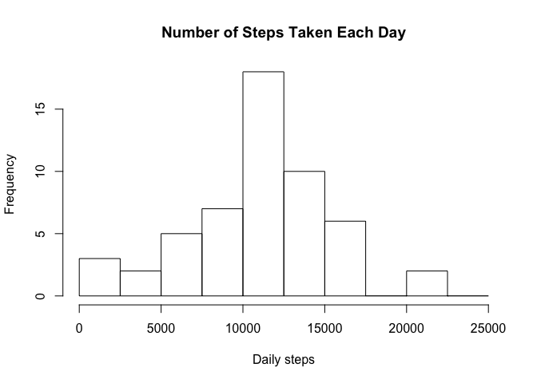
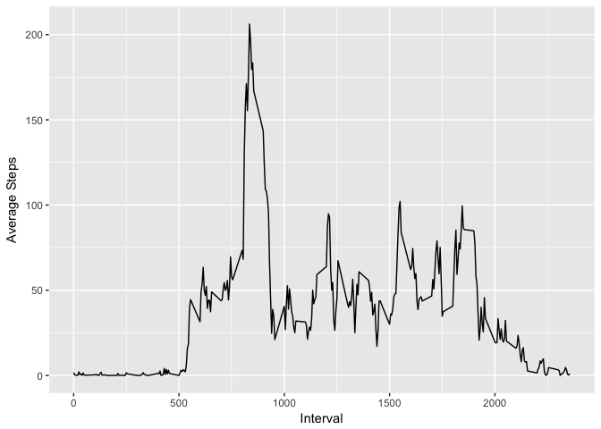
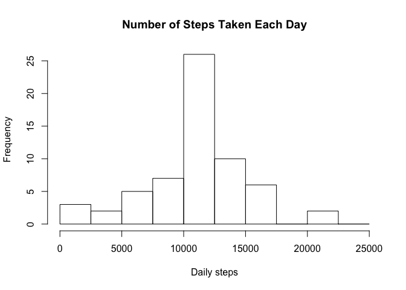
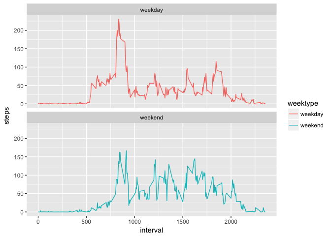

Reproducible Research Project 1
-------------------------------

The data for this project can be found here:
<https://d396qusza40orc.cloudfront.net/repdata%2Fdata%2Factivity.zip>
The variables included in this dataset are:

-steps: Number of steps taking in a 5-minute interval (missing values
are coded as 𝙽𝙰) -date: The date on which the measurement was taken in
YYYY-MM-DD format -interval: Identifier for the 5-minute interval in
which measurement was taken \#\#\#librarys

    library(dtplyr)
    library(dplyr)

    ## 
    ## Attaching package: 'dplyr'

    ## The following objects are masked from 'package:stats':
    ## 
    ##     filter, lag

    ## The following objects are masked from 'package:base':
    ## 
    ##     intersect, setdiff, setequal, union

    library(ggplot2)
    library(sqldf)

    ## Loading required package: gsubfn

    ## Loading required package: proto

    ## Warning in fun(libname, pkgname): couldn't connect to display ":0"

    ## Loading required package: RSQLite

    library(lubridate)

    ## 
    ## Attaching package: 'lubridate'

    ## The following object is masked from 'package:base':
    ## 
    ##     date

### read in dataset and process

    activity <- read.csv("activity.csv")
    dim(activity)

    ## [1] 17568     3

    names(activity)

    ## [1] "steps"    "date"     "interval"

### Histogram of the total number of steps taken each day

    #need to sum the steps per day
    steps_by_date<-summarise(group_by(activity, date), daily_steps=sum(steps))
    hist(steps_by_date$daily_steps, xlab="Daily steps", main="Number of Steps Taken Each Day",breaks=seq(from=0, to=25000, by=2500))

Mean and median number of steps taken each day
----------------------------------------------

    summarise(filter(steps_by_date, daily_steps>=0), Mean_daily_steps=mean(daily_steps) )

    ## # A tibble: 1 × 1
    ##   Mean_daily_steps
    ##              <dbl>
    ## 1         10766.19

    summarise(filter(steps_by_date, daily_steps>=0), Median_daily_steps=median(daily_steps) )

    ## # A tibble: 1 × 1
    ##   Median_daily_steps
    ##                <int>
    ## 1              10765

Time series plot of the average number of steps taken
-----------------------------------------------------

    #first we have to find average steps at each interval
    average_by_interval <- summarise(group_by(na.omit(activity),interval), average_steps=mean(steps))
    ggplot(data=average_by_interval, aes( interval,average_steps)) + geom_line() +   xlab("Interval") + ylab("Average Steps")

\#\#The 5-minute interval that, on average, contains the maximum number
of steps

    filter(average_by_interval, average_steps==max(average_by_interval$average_steps))

    ## # A tibble: 1 × 2
    ##   interval average_steps
    ##      <int>         <dbl>
    ## 1      835      206.1698

Code to describe and show a strategy for imputing missing data
--------------------------------------------------------------

    #how many missing values of steps do we have? 
    sum(is.na(activity$steps))

    ## [1] 2304

    #impute missing value by using mean for that interval
    #identify which rows are missing
    missing<- is.na(activity$steps)

    #calculate average steps at each interval
    avg_interval <- tapply(activity$steps, activity$interval, mean, na.rm=TRUE, simplify=TRUE)
    #create new data set with imputed average steps by interval for each missing value of steps
    activity_full<-activity
    activity_full$steps[missing] <- avg_interval[as.character(activity$interval[missing])]

Histogram of the total number of steps taken each day after missing values are imputed
--------------------------------------------------------------------------------------

    steps_by_date_full<-summarise(group_by(activity_full, date), daily_steps=sum(steps))
    hist(steps_by_date_full$daily_steps, xlab="Daily steps", main="Number of Steps Taken Each Day",breaks=seq(from=0, to=25000, by=2500))

    #mean and median of full dataset with imputed values
    summarise(filter(steps_by_date_full, daily_steps>=0), Mean_daily_steps=mean(daily_steps) )

    ## # A tibble: 1 × 1
    ##   Mean_daily_steps
    ##              <dbl>
    ## 1         10766.19

    summarise(filter(steps_by_date_full, daily_steps>=0), Median_daily_steps=median(daily_steps) )

    ## # A tibble: 1 × 1
    ##   Median_daily_steps
    ##                <dbl>
    ## 1           10766.19

Panel plot comparing the average number of steps taken per 5-minute interval across weekdays and weekends
---------------------------------------------------------------------------------------------------------

    #read date field in as a date
    activity_full$date<-ymd(activity_full$date)
      
    #identify which days are weekdays and which are weekends
    activity_full1<-mutate(activity_full, weektype = ifelse(weekdays(activity_full$date) == "Saturday" | weekdays(activity_full$date) == "Sunday", "weekend", "weekday"))

    #First group by weekdaytype and then get means then create plots
    by_weekdaytype <- activity_full1 %>%  group_by(interval, weektype) %>%  summarise(steps = mean(steps))
    ggplot(by_weekdaytype, aes(x=interval, y=steps, color = weektype)) +
      geom_line() + facet_wrap(~weektype, ncol = 1, nrow=2)

